# Mycelium Architecture Diagrams

Visual guide to Mycelium's architecture, deployment modes, and performance characteristics.

## Table of Contents

1. [Core Architecture](#core-architecture)
2. [Deployment Flexibility](#deployment-flexibility)
3. [Transport Layer](#transport-layer)
4. [Message Flow](#message-flow)
5. [Parallel Backtesting](#parallel-backtesting)
6. [Performance Spectrum](#performance-spectrum)
7. [Cross-Language Integration](#cross-language-integration)

---

## Core Architecture

### High-Level Overview

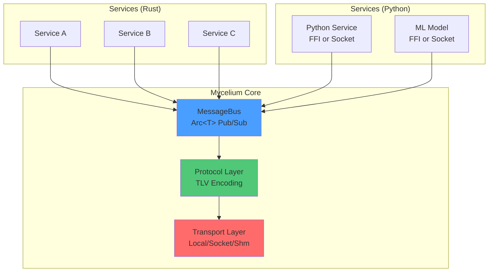

### Actor Model

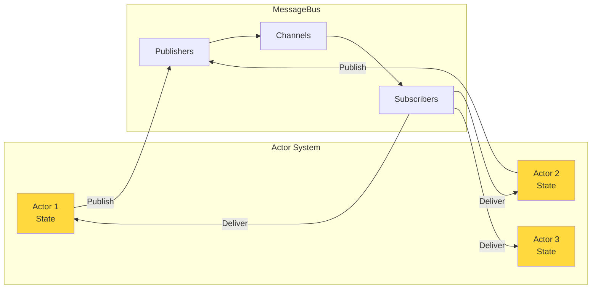

**Key Principles:**
- Each actor owns its state
- No shared mutable state
- Communication via messages only
- Perfect for parallelization

---

## Deployment Flexibility

### Single Process (In-Process, Fastest)

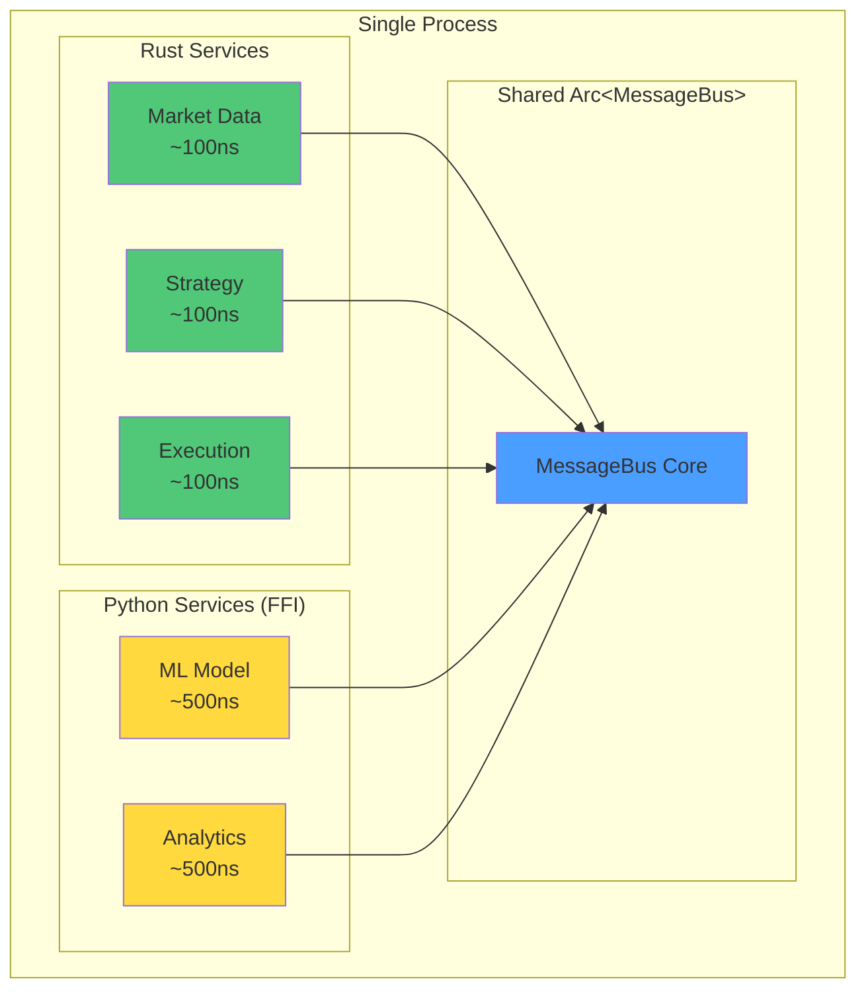

**Performance:**
- Rust ↔ Rust: ~100ns (Arc<T>)
- Python ↔ Rust: ~100-500ns (FFI)
- All in shared memory

### Multi-Process (Isolated, Shared Memory)

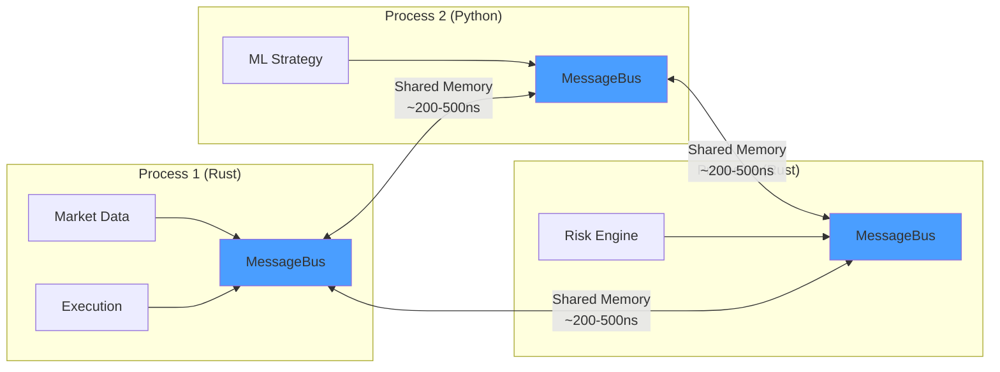

**Benefits:**
- Process isolation (crashes don't propagate)
- Python GIL doesn't block Rust
- ~200-500ns latency (10-50x faster than sockets)

### Distributed (Multi-Machine)

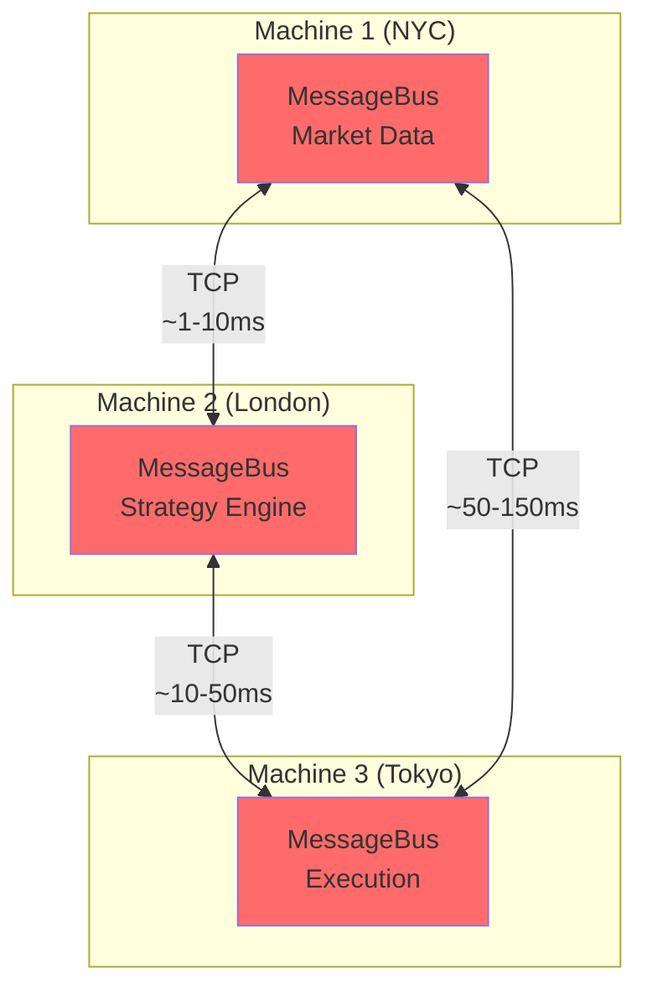

**Use Cases:**
- Geographic distribution
- Kubernetes/cloud deployments
- Regulatory requirements (data residency)

---

## Transport Layer

### Transport Selection Decision Tree

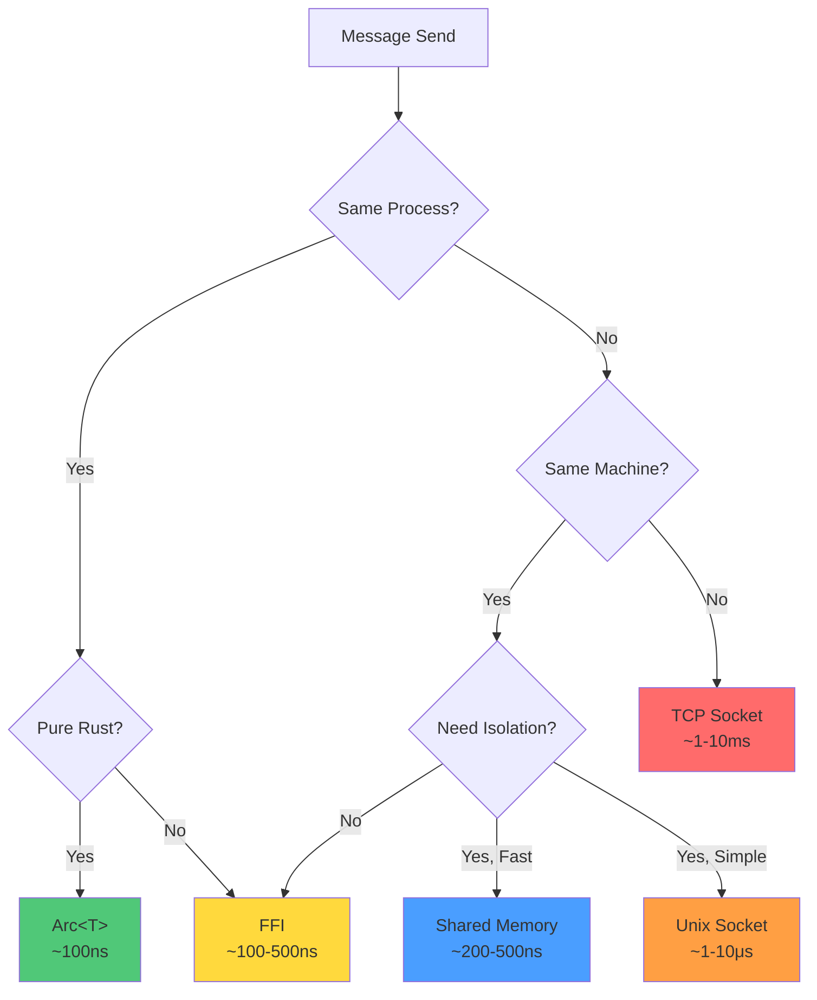

### Transport Implementation Stack

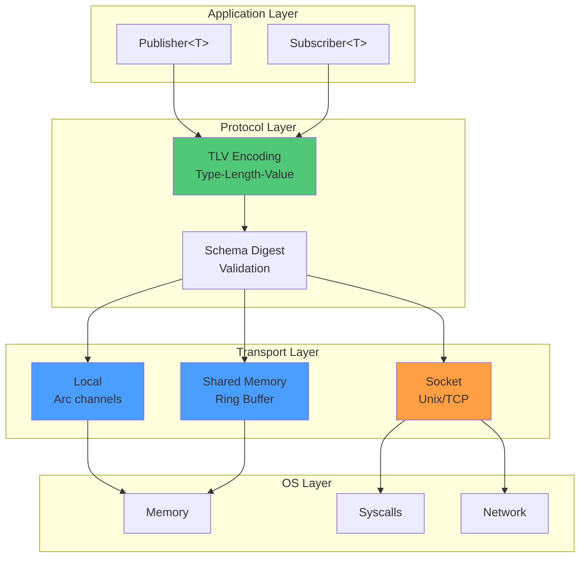

---

## Message Flow

### Local Transport (In-Process)

```mermaid
sequenceDiagram
    participant P as Publisher
    participant MB as MessageBus
    participant C as Channel
    participant S as Subscriber

    P->>MB: publish(msg)
    MB->>MB: Arc::new(msg)
    MB->>C: send(Arc&lt;msg&gt;)
    C->>S: recv() → Arc&lt;msg&gt;

    Note over P,S: Zero-copy: ~100ns
```

### FFI Transport (Cross-Language, In-Process)

```mermaid
sequenceDiagram
    participant Py as Python Service
    participant FFI as FFI Layer
    participant MB as MessageBus (Rust)
    participant S as Subscriber (Rust)

    Py->>FFI: publish(msg)
    FFI->>FFI: Serialize to TLV
    FFI->>MB: publish_bytes()
    MB->>MB: Arc::new(bytes)
    MB->>S: recv() → Arc&lt;bytes&gt;
    S->>S: Deserialize from TLV

    Note over Py,S: Shared Arc: ~100-500ns
```

### Shared Memory Transport (Cross-Process)

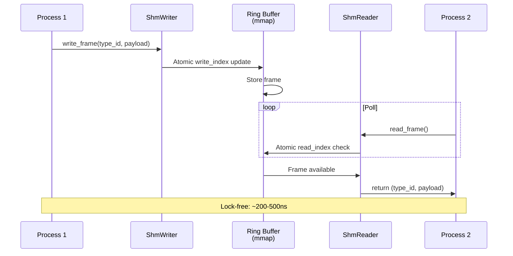

### Socket Transport (Cross-Process/Machine)

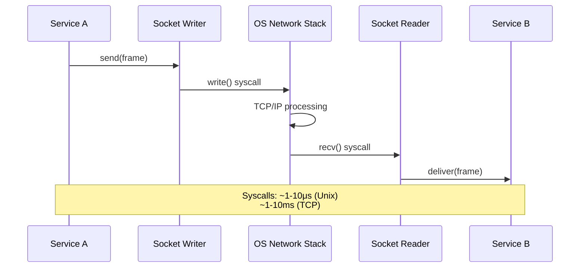

---

## Parallel Backtesting

### Sequential Backtesting (Traditional Approach)

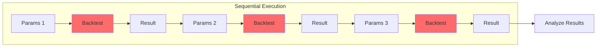

**Time**: N × backtest_duration

### Mycelium Parallel Backtesting (Actor-Per-Portfolio)

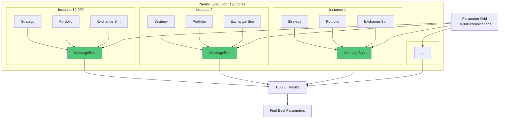

**Time**: backtest_duration (parallelized across all cores)

### Monte Carlo Simulation

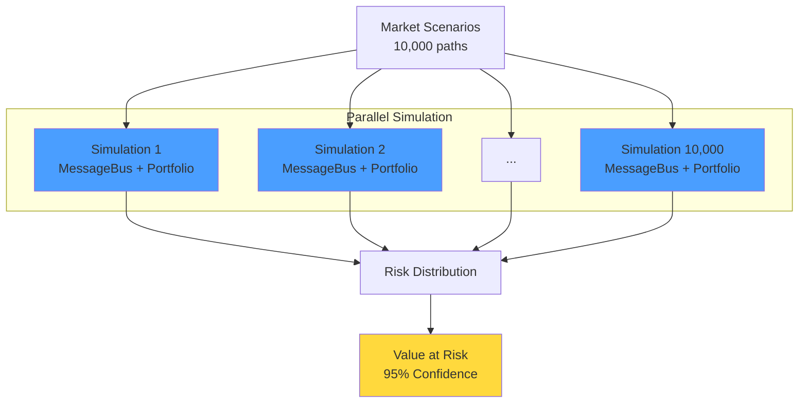

**Key Advantage**: Each simulation is completely isolated (no state contamination)

---

## Performance Spectrum

### Latency Comparison

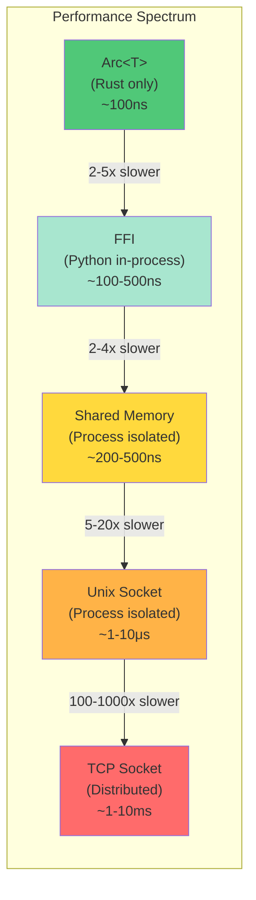

### Performance vs Isolation Tradeoff

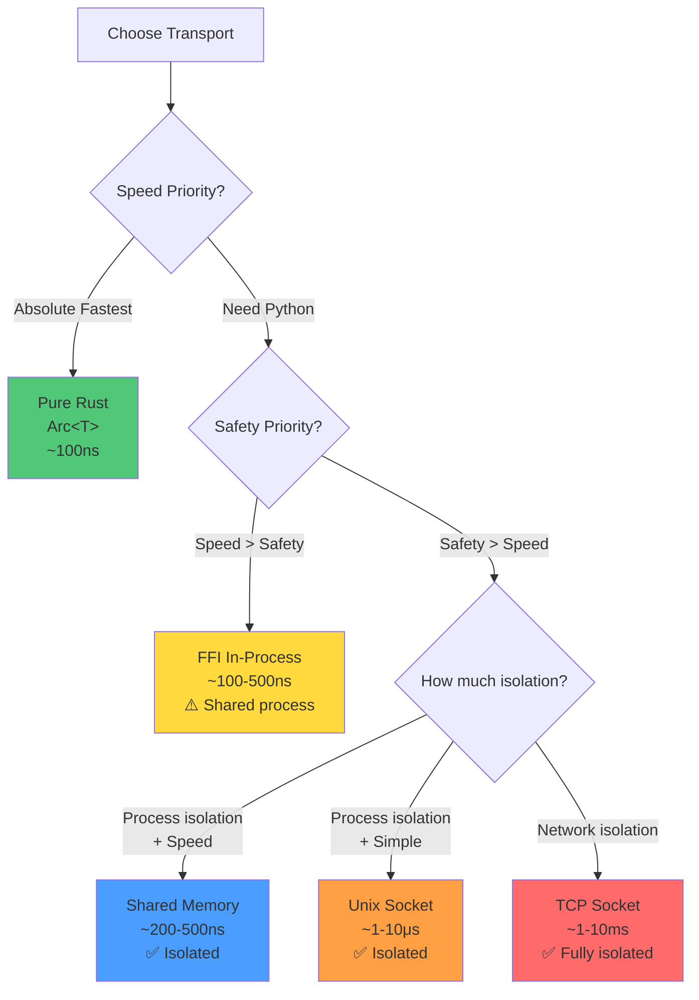

---

## Cross-Language Integration

### Python FFI (In-Process)

```mermaid
graph TB
    subgraph "Single Process Memory Space"
        subgraph "Rust Side"
            MB_Rust[Arc&lt;MessageBus&gt;]
            R1[Rust Service A]
            R2[Rust Service B]
        end

        subgraph "FFI Boundary"
            FFI[PyO3 FFI Layer<br/>~200-300ns overhead]
        end

        subgraph "Python Side"
            MB_Py[Runtime<br/>(Arc ref via FFI)]
            P1[Python Service]
            P2[ML Model]
        end
    end

    R1 --> MB_Rust
    R2 --> MB_Rust
    MB_Rust <-->|Direct Arc access| FFI
    FFI <-->|Python bindings| MB_Py
    P1 --> MB_Py
    P2 --> MB_Py

    style MB_Rust fill:#4a9eff
    style FFI fill:#ffd93d
    style MB_Py fill:#ffd93d
```

**Overhead Breakdown:**
- TLV serialization: ~200-300ns (unavoidable for cross-language)
- FFI call overhead: ~100-200ns
- Total: ~100-500ns

### Python Socket (Out-of-Process)

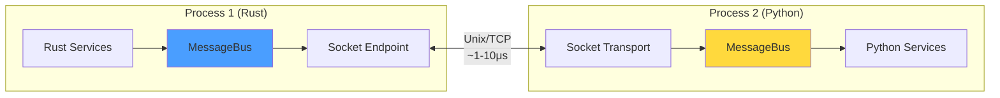

**Benefits:**
- Process isolation (crash safety)
- No FFI complexity
- Traditional deployment model

### Hybrid Deployment

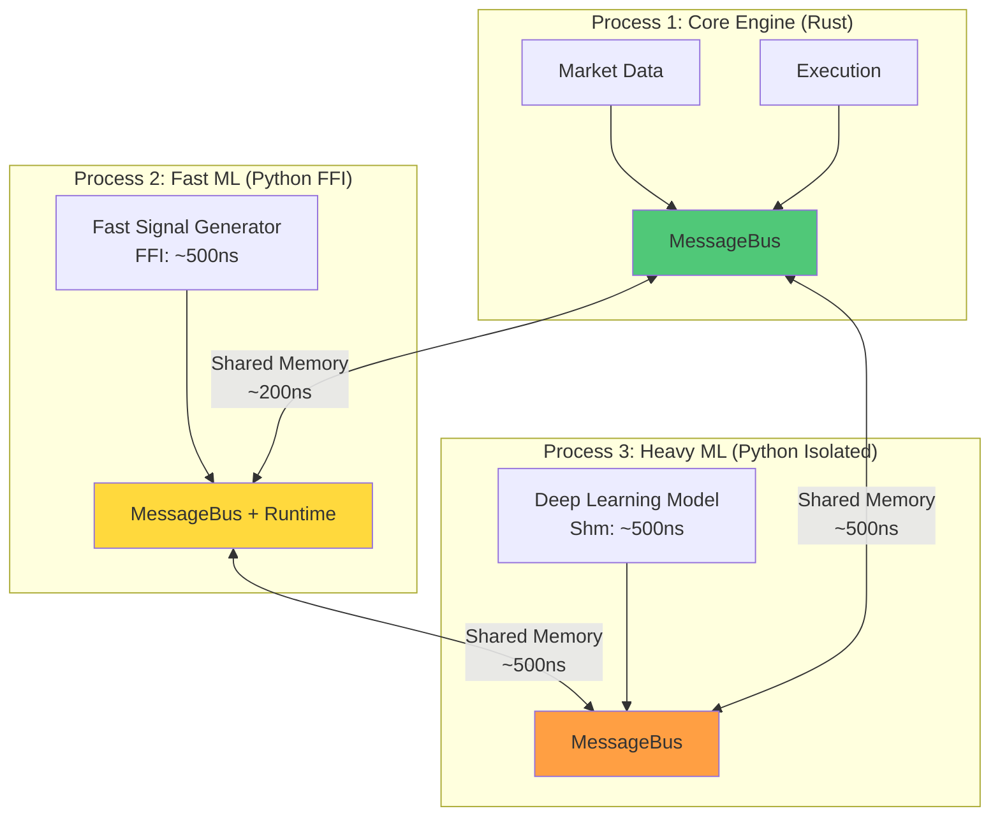

**Strategy:**
- Critical path in Rust: ~100ns
- Fast Python signals via FFI: ~500ns
- Heavy Python models isolated: ~500ns with safety

---

## Topology-Driven Deployment

### Configuration-Based Routing

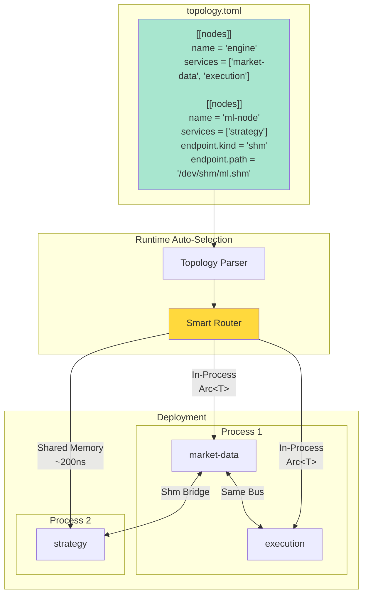

**Developer Experience:**
```rust
// Same code, different deployments via topology.toml
let bus = MessageBus::from_topology("topology.toml", "my-service")?;
let pub = bus.publisher::<Signal>();  // Auto-routes!
```

---

## Summary

### Key Architectural Principles

1. **Actor Model**: Each service is an independent actor with isolated state
2. **Message-Driven**: All communication via typed messages (no shared mutable state)
3. **Transport Agnostic**: Same API works across Arc/FFI/Shm/Socket
4. **Deployment Flexible**: Choose performance/isolation tradeoff without code changes
5. **Parallel-First**: Designed for embarrassingly parallel workloads

### Performance Hierarchy

| Transport | Latency | Isolation | Use Case |
|-----------|---------|-----------|----------|
| Arc<T> | ~100ns | None | Pure Rust, maximum speed |
| FFI | ~100-500ns | None | Python in-process, fast |
| Shared Memory | ~200-500ns | ✅ Process | Python isolated, very fast |
| Unix Socket | ~1-10μs | ✅ Process | Simple, good enough |
| TCP Socket | ~1-10ms | ✅ Network | Distributed, geo-dispersed |

### Killer Features

1. **Same-code, multi-deployment**: Write once, deploy anywhere (in-process → distributed)
2. **Parallel backtesting**: Spawn 10,000 independent actor systems trivially
3. **Language flexibility**: Rust, Python, OCaml with minimal overhead
4. **Compile-time optimization**: Rust monomorphization eliminates runtime branching

---

**See Also:**
- [Cross-Language Integration](CROSS_LANGUAGE_INTEGRATION.md)
- [Deployment Options](../DEPLOYMENT_OPTIONS.md)
- [Shared Memory Transport](../implementation/SHARED_MEMORY_TRANSPORT.md)
