# Mycelium Architecture Diagrams

Visual guide to Mycelium's architecture, deployment modes, and performance characteristics.

## Table of Contents

1. [Core Architecture](#core-architecture)
2. [Deployment Flexibility](#deployment-flexibility)
3. [Transport Layer](#transport-layer)
4. [Message Flow](#message-flow)
5. [Parallel Backtesting](#parallel-backtesting)
6. [Performance Spectrum](#performance-spectrum)
7. [Cross-Language Integration](#cross-language-integration)
8. [Real-World Multi-Language Trading System](#real-world-multi-language-trading-system)

---

## Core Architecture

### High-Level Overview


### Actor Model


**Key Principles:**
- Each actor owns its state
- No shared mutable state
- Communication via messages only
- Perfect for parallelization

---

## Deployment Flexibility

### Single Process (In-Process, Fastest)


**Performance:**
- Rust ↔ Rust: ~100ns (Arc<T>)
- Python ↔ Rust: ~100-500ns (FFI)
- All in shared memory

### Multi-Process (Isolated, Shared Memory)


**Benefits:**
- Process isolation (crashes don't propagate)
- Python GIL doesn't block Rust
- ~200-500ns latency (10-50x faster than sockets)

### Distributed (Multi-Machine)


**Use Cases:**
- Geographic distribution
- Kubernetes/cloud deployments
- Regulatory requirements (data residency)

---

## Transport Layer

### Transport Selection Decision Tree


### Transport Implementation Stack


---

## Message Flow

### Local Transport (In-Process)

```mermaid
sequenceDiagram
    participant P as Publisher
    participant MB as MessageBus
    participant C as Channel
    participant S as Subscriber

    P->>MB: publish(msg)
    MB->>MB: Arc::new(msg)
    MB->>C: send(Arc&lt;msg&gt;)
    C->>S: recv() → Arc&lt;msg&gt;

    Note over P,S: Zero-copy: ~100ns
```

### FFI Transport (Cross-Language, In-Process)

```mermaid
sequenceDiagram
    participant Py as Python Service
    participant FFI as FFI Layer
    participant MB as MessageBus (Rust)
    participant S as Subscriber (Rust)

    Py->>FFI: publish(msg)
    FFI->>FFI: Serialize to TLV
    FFI->>MB: publish_bytes()
    MB->>MB: Arc::new(bytes)
    MB->>S: recv() → Arc&lt;bytes&gt;
    S->>S: Deserialize from TLV

    Note over Py,S: Shared Arc: ~100-500ns
```

### Shared Memory Transport (Cross-Process)


### Socket Transport (Cross-Process/Machine)


---

## Parallel Backtesting

### Sequential Backtesting (Traditional Approach)


**Time**: N × backtest_duration

### Mycelium Parallel Backtesting (Actor-Per-Portfolio)


**Time**: backtest_duration (parallelized across all cores)

### Monte Carlo Simulation


**Key Advantage**: Each simulation is completely isolated (no state contamination)

---

## Performance Spectrum

### Latency Comparison


### Performance vs Isolation Tradeoff

```mermaid
graph TD
    Start[Choose Transport]

    Start --> Speed{Speed Priority?}

    Speed -->|Absolute Fastest| Rust[Pure Rust<br/>Arc&lt;T&gt;<br/>~100ns]
    Speed -->|Need Python| Safety{Safety Priority?}

    Safety -->|Speed > Safety| FFI_Path[FFI In-Process<br/>~100-500ns<br/>⚠️ Shared process]
    Safety -->|Safety > Speed| Isolation{How much isolation?}

    Isolation -->|Process isolation<br/>+ Speed| Shm_Path[Shared Memory<br/>~200-500ns<br/>✅ Isolated]
    Isolation -->|Process isolation<br/>+ Simple| Unix_Path[Unix Socket<br/>~1-10μs<br/>✅ Isolated]
    Isolation -->|Network isolation| TCP_Path[TCP Socket<br/>~1-10ms<br/>✅ Fully isolated]

    style Rust fill:#50c878
    style FFI_Path fill:#ffd93d
    style Shm_Path fill:#4a9eff
    style Unix_Path fill:#ff9f43
    style TCP_Path fill:#ff6b6b
```



---

## Cross-Language Integration

### Python FFI (In-Process)

```mermaid
graph TB
    subgraph "Single Process Memory Space"
        subgraph "Rust Side"
            MB_Rust[Arc&lt;MessageBus&gt;]
            R1[Rust Service A]
            R2[Rust Service B]
        end

        subgraph "FFI Boundary"
            FFI[PyO3 FFI Layer<br/>~200-300ns overhead]
        end

        subgraph "Python Side"
            MB_Py[Runtime<br/>(Arc ref via FFI)]
            P1[Python Service]
            P2[ML Model]
        end
    end

    R1 --> MB_Rust
    R2 --> MB_Rust
    MB_Rust <-->|Direct Arc access| FFI
    FFI <-->|Python bindings| MB_Py
    P1 --> MB_Py
    P2 --> MB_Py

    style MB_Rust fill:#4a9eff
    style FFI fill:#ffd93d
    style MB_Py fill:#ffd93d
```

**Overhead Breakdown:**
- TLV serialization: ~200-300ns (unavoidable for cross-language)
- FFI call overhead: ~100-200ns
- Total: ~100-500ns

### Python Socket (Out-of-Process)

```mermaid
graph LR
    subgraph "Process 1 (Rust)"
        MB1[MessageBus]
        R1[Rust Services]
        Sock1[Socket Endpoint]
        R1 --> MB1
        MB1 --> Sock1
    end

    subgraph "Process 2 (Python)"
        Sock2[Socket Transport]
        MB2[MessageBus]
        P1[Python Services]
        Sock2 --> MB2
        MB2 --> P1
    end

    Sock1 <-->|Unix/TCP<br/>~1-10μs| Sock2

    style MB1 fill:#4a9eff
    style MB2 fill:#ffd93d
```



**Benefits:**
- Process isolation (crash safety)
- No FFI complexity
- Traditional deployment model

### Hybrid Deployment


**Strategy:**
- Critical path in Rust: ~100ns
- Fast Python signals via FFI: ~500ns
- Heavy Python models isolated: ~500ns with safety

---

## Topology-Driven Deployment

### Configuration-Based Routing


**Developer Experience:**
```rust
// Same code, different deployments via topology.toml
let bus = MessageBus::from_topology("topology.toml", "my-service")?;
let pub = bus.publisher::<Signal>();  // Auto-routes!
```

---

## Real-World Multi-Language Trading System

### Complete Trading Platform Architecture

This demonstrates a realistic high-performance trading system leveraging all three languages:
- **Rust**: Core infrastructure, market data, execution
- **Python**: ML models, analytics, backtesting
- **OCaml**: Formal trading logic, risk management, compliance

```mermaid
graph TB
    subgraph "Core Infrastructure (Rust)"
        MB[MessageBus<br/>~100ns latency]

        subgraph "Market Data Layer"
            MD1[Exchange Feed A<br/>WebSocket]
            MD2[Exchange Feed B<br/>WebSocket]
            MD3[Market Data Aggregator]
            Norm[Normalizer]
        end

        subgraph "Execution Layer"
            ExecEngine[Execution Engine]
            OrderRouter[Smart Order Router]
            FillManager[Fill Manager]
        end

        MD1 --> MD3
        MD2 --> MD3
        MD3 --> Norm
        Norm --> MB

        MB --> ExecEngine
        ExecEngine --> OrderRouter
        OrderRouter --> FillManager
    end

    subgraph "ML & Analytics (Python via FFI)"
        subgraph "Feature Engineering"
            FE1[Technical Indicators]
            FE2[Order Flow Features]
            FE3[Microstructure Features]
        end

        subgraph "Signal Generation"
            ML1[Deep Learning Model<br/>Price Prediction]
            ML2[Gradient Boosting<br/>Regime Detection]
            ML3[Ensemble Combiner]
        end

        subgraph "Portfolio Optimization"
            PO1[Mean-Variance Optimizer]
            PO2[Risk Budgeting]
            PO3[Transaction Cost Model]
        end

        FE1 --> ML1
        FE2 --> ML2
        FE3 --> ML3

        ML1 --> PO1
        ML2 --> PO2
        ML3 --> PO3
    end

    subgraph "Trading Framework (OCaml via Shm)"
        subgraph "Order Management"
            OMS[Order Management System]
            OrderVal[Order Validation]
            OrderBook[Internal Order Book]
        end

        subgraph "Risk Engine"
            PreTrade[Pre-Trade Risk]
            RealTime[Real-Time Risk Monitor]
            PostTrade[Post-Trade Analysis]
            VaR[VaR Calculator]
        end

        subgraph "Strategy Engine"
            AlphaGen[Alpha Generator]
            StratLogic[Strategy Logic<br/>Formal Verification]
            PortMgr[Portfolio Manager]
        end

        subgraph "Compliance"
            RegCheck[Regulatory Checks]
            AuditLog[Audit Logger]
            Reporting[Report Generator]
        end

        OMS --> OrderVal
        OrderVal --> OrderBook

        PreTrade --> RealTime
        RealTime --> PostTrade
        PostTrade --> VaR

        AlphaGen --> StratLogic
        StratLogic --> PortMgr

        RegCheck --> AuditLog
        AuditLog --> Reporting
    end

    %% Connections
    MB <-->|FFI ~500ns| FE1
    MB <-->|FFI ~500ns| FE2
    MB <-->|FFI ~500ns| FE3

    PO1 -->|FFI ~500ns| MB
    PO2 -->|FFI ~500ns| MB
    PO3 -->|FFI ~500ns| MB

    MB <-->|Shm ~200ns| OMS
    MB <-->|Shm ~200ns| PreTrade
    MB <-->|Shm ~200ns| AlphaGen
    MB <-->|Shm ~200ns| RegCheck

    PortMgr -->|Shm ~200ns| MB
    OrderBook -->|Shm ~200ns| MB

    style MB fill:#4a9eff
    style MD3 fill:#50c878
    style ExecEngine fill:#50c878
    style ML1 fill:#ffd93d
    style ML2 fill:#ffd93d
    style ML3 fill:#ffd93d
    style OMS fill:#ff9f43
    style PreTrade fill:#ff9f43
    style StratLogic fill:#ff9f43
```

### Message Flow in Trading System

```mermaid
sequenceDiagram
    participant Exchange as Exchange Feed
    participant Rust as Market Data (Rust)
    participant MB as MessageBus
    participant Py as ML Signals (Python)
    participant OCaml as Risk Engine (OCaml)
    participant Exec as Execution (Rust)

    Exchange->>Rust: Market tick (WebSocket)
    Rust->>MB: MarketData msg (~100ns)

    MB->>Py: Forward to Python (~500ns FFI)
    Py->>Py: Feature extraction
    Py->>Py: ML inference
    Py->>MB: TradingSignal (~500ns FFI)

    MB->>OCaml: Forward to OCaml (~200ns Shm)
    OCaml->>OCaml: Pre-trade risk check
    OCaml->>OCaml: Position size calculation
    OCaml->>OCaml: Regulatory validation
    OCaml->>MB: OrderRequest (~200ns Shm)

    MB->>Exec: Forward to Execution (~100ns)
    Exec->>Exchange: Place order (WebSocket)
    Exchange->>Exec: Fill confirmation
    Exec->>MB: Fill msg (~100ns)

    MB->>OCaml: Update positions (~200ns Shm)
    MB->>Py: Update models (~500ns FFI)

    Note over Exchange,Py: Total latency: ~1.5μs<br/>(tick → decision → order)
```

### Deployment Topology

```mermaid
graph TB
    subgraph "Main Trading Process"
        subgraph "Rust Core (~100ns latency)"
            Bus[MessageBus]
            MD[Market Data]
            Exec[Execution]
            MD --> Bus
            Exec --> Bus
        end

        subgraph "Python ML (FFI, ~500ns)"
            PyRuntime[Runtime<br/>FFI Access to Arc&lt;MessageBus&gt;]
            Features[Feature Engine]
            Signals[Signal Generator]
            Portfolio[Portfolio Optimizer]

            Features --> PyRuntime
            Signals --> PyRuntime
            Portfolio --> PyRuntime
        end
    end

    subgraph "OCaml Process (Isolated)"
        OBus[MessageBus]

        subgraph "Order Management"
            OMS[OMS]
            Book[Order Book]
        end

        subgraph "Risk"
            Risk[Risk Engine]
            VaR[VaR]
        end

        subgraph "Strategy"
            Alpha[Alpha Generator]
            Logic[Strategy Logic]
        end

        OMS --> OBus
        Book --> OBus
        Risk --> OBus
        VaR --> OBus
        Alpha --> OBus
        Logic --> OBus
    end

    Bus <-->|Shared Memory<br/>~200ns| OBus
    PyRuntime <-->|FFI<br/>~500ns| Bus

    style Bus fill:#4a9eff
    style OBus fill:#ff9f43
    style PyRuntime fill:#ffd93d
```

**Rationale for Language Choices:**

| Component | Language | Why |
|-----------|----------|-----|
| **Market Data** | Rust | Lowest latency, zero-copy processing |
| **Execution** | Rust | Critical path, needs ~100ns performance |
| **ML Models** | Python | Rich ecosystem (PyTorch, scikit-learn) |
| **Feature Engineering** | Python | Fast iteration, data science libraries |
| **Order Management** | OCaml | Type safety, formal verification possible |
| **Risk Engine** | OCaml | Correctness over speed, strong typing |
| **Strategy Logic** | OCaml | Mathematical precision, proof systems |
| **Compliance** | OCaml | Audit trail, provable correctness |

### Performance Analysis

```mermaid
graph LR
    subgraph "Critical Path Analysis"
        T1[Market Tick<br/>0ns]
        T2[Rust Processing<br/>+100ns]
        T3[Python ML<br/>+500ns]
        T4[OCaml Risk<br/>+200ns]
        T5[Rust Execution<br/>+100ns]
        T6[Order Sent<br/>~900ns total]
    end

    T1 --> T2 --> T3 --> T4 --> T5 --> T6

    style T1 fill:#50c878
    style T2 fill:#50c878
    style T3 fill:#ffd93d
    style T4 fill:#ff9f43
    style T5 fill:#50c878
    style T6 fill:#50c878
```

**Total Latency Budget:**
- Market data ingestion (Rust): ~100ns
- ML signal generation (Python FFI): ~500ns
- Risk validation (OCaml Shm): ~200ns
- Order execution (Rust): ~100ns
- **Total: ~900ns** from tick to order

Compare to:
- **NautilusTrader**: ~10-50μs (GIL + socket overhead)
- **Traditional Java HFT**: ~1-5μs (GC pauses)
- **Pure C++**: ~200-500ns (but no ML flexibility)

### Alternative Deployment: All Isolated

```mermaid
graph TB
    subgraph "Process 1: Market Data (Rust)"
        MD[Market Data Service]
        MDB[MessageBus]
        MD --> MDB
    end

    subgraph "Process 2: Feature Engineering (Python)"
        FE[Feature Engine]
        FEB[MessageBus]
        FE --> FEB
    end

    subgraph "Process 3: ML Signals (Python)"
        ML[ML Models]
        MLB[MessageBus]
        ML --> MLB
    end

    subgraph "Process 4: OCaml OMS"
        OMS[Order Manager]
        OMSB[MessageBus]
        OMS --> OMSB
    end

    subgraph "Process 5: OCaml Risk"
        Risk[Risk Engine]
        RiskB[MessageBus]
        Risk --> RiskB
    end

    subgraph "Process 6: Execution (Rust)"
        Exec[Execution Engine]
        ExecB[MessageBus]
        Exec --> ExecB
    end

    MDB <-->|Shm ~200ns| FEB
    FEB <-->|Shm ~200ns| MLB
    MLB <-->|Shm ~200ns| OMSB
    OMSB <-->|Shm ~200ns| RiskB
    RiskB <-->|Shm ~200ns| ExecB
    ExecB <-->|Shm ~200ns| MDB

    style MDB fill:#50c878
    style FEB fill:#ffd93d
    style MLB fill:#ffd93d
    style OMSB fill:#ff9f43
    style RiskB fill:#ff9f43
    style ExecB fill:#50c878
```

**Benefits of Isolation:**
- Python crash doesn't kill OCaml or Rust
- Each service independently restartable
- Clear security boundaries
- Easier testing and debugging

**Cost:**
- ~200ns per hop (vs ~100-500ns in-process)
- Total latency: ~1.2μs (still excellent!)

### Hybrid Deployment Strategy

```mermaid
graph TB
    subgraph "Ultra-Fast Process (Rust + Python FFI)"
        direction TB
        RBus[MessageBus]

        subgraph "Critical Path (Rust)"
            MD[Market Data<br/>~100ns]
            Exec[Execution<br/>~100ns]
        end

        subgraph "Fast ML (Python FFI)"
            FastML[Fast Signals<br/>~500ns<br/>Linear models, heuristics]
        end

        MD --> RBus
        Exec --> RBus
        FastML --> RBus
    end

    subgraph "Heavy ML Process (Python Isolated)"
        PBus[MessageBus]

        DeepML[Deep Learning<br/>~10-100ms<br/>CNNs, Transformers]
        Backtest[Backtester<br/>Non-critical]
        Analytics[Analytics<br/>Non-critical]

        DeepML --> PBus
        Backtest --> PBus
        Analytics --> PBus
    end

    subgraph "OCaml Process (Correctness-Critical)"
        OBus[MessageBus]

        OMS[Order Manager<br/>Type-safe]
        Risk[Risk Engine<br/>Formally verified]
        Compliance[Compliance<br/>Audit logging]

        OMS --> OBus
        Risk --> OBus
        Compliance --> OBus
    end

    RBus <-->|Shm ~200ns| OBus
    RBus <-->|Shm ~200ns| PBus
    OBus <-->|Shm ~200ns| PBus

    style RBus fill:#50c878
    style FastML fill:#ffd93d
    style PBus fill:#ffd93d
    style OBus fill:#ff9f43
```

**Smart Partitioning:**
- **Critical path (Rust + Fast Python)**: ~500ns
- **Heavy ML (Isolated Python)**: 10-100ms, doesn't block critical path
- **OCaml (Isolated)**: ~200ns latency, crash-safe, verifiable

**Result:** Sub-microsecond latency for critical decisions, unlimited complexity for non-critical analysis.

### Transport Boundaries and FFI Details

```mermaid
graph TB
    subgraph "Process 1: Main Trading Engine"
        subgraph "Rust Native Code"
            MB_Rust[Arc&lt;MessageBus&gt;<br/>Rust Native]
            MD_Rust[Market Data Collector<br/>Rust]
            Exec_Rust[Execution Engine<br/>Rust]

            MD_Rust -->|Arc::clone<br/>~100ns<br/>Zero-copy| MB_Rust
            Exec_Rust -->|Arc::clone<br/>~100ns<br/>Zero-copy| MB_Rust
        end

        subgraph "FFI Boundary (PyO3)"
            FFI_Layer[PyO3 FFI Layer<br/>TLV Serialization<br/>~200-300ns overhead]
        end

        subgraph "Python Embedded (GIL)"
            PyRuntime[Runtime<br/>Arc ref via FFI pointer]

            subgraph "Python Services"
                FE_Py[Feature Engine<br/>Python]
                ML_Py[ML Signals<br/>PyTorch/scikit-learn]
                PO_Py[Portfolio Optimizer<br/>NumPy/SciPy]
            end

            FE_Py -->|Python call| PyRuntime
            ML_Py -->|Python call| PyRuntime
            PO_Py -->|Python call| PyRuntime
        end

        MB_Rust <-->|PyO3 bindings<br/>~100-500ns total<br/>Shared memory space| FFI_Layer
        FFI_Layer <-->|Native Python<br/>~10-50ns| PyRuntime
    end

    subgraph "Process 2: OCaml Trading Framework"
        subgraph "OCaml Native Code"
            MB_OCaml[MessageBus<br/>OCaml binding]

            subgraph "Order Management"
                OMS_OCaml[OMS<br/>OCaml]
                Book_OCaml[Order Book<br/>OCaml]
            end

            subgraph "Risk System"
                Risk_OCaml[Risk Engine<br/>OCaml]
                VaR_OCaml[VaR Calculator<br/>OCaml]
            end

            subgraph "Strategy"
                Alpha_OCaml[Alpha Generator<br/>OCaml]
                Logic_OCaml[Strategy Logic<br/>OCaml + Formal Proofs]
            end

            OMS_OCaml --> MB_OCaml
            Book_OCaml --> MB_OCaml
            Risk_OCaml --> MB_OCaml
            VaR_OCaml --> MB_OCaml
            Alpha_OCaml --> MB_OCaml
            Logic_OCaml --> MB_OCaml
        end

        subgraph "Shared Memory Bridge"
            ShmWriter_OCaml[ShmWriter<br/>/dev/shm/ocaml.shm]
            ShmReader_OCaml[ShmReader<br/>/dev/shm/rust.shm]
        end

        MB_OCaml -->|OCaml native<br/>~50ns| ShmWriter_OCaml
        ShmReader_OCaml -->|OCaml native<br/>~50ns| MB_OCaml
    end

    subgraph "Shared Memory Regions (mmap)"
        Shm1["/dev/shm/rust.shm"<br/>Ring Buffer<br/>1MB capacity]
        Shm2["/dev/shm/ocaml.shm"<br/>Ring Buffer<br/>1MB capacity]
    end

    subgraph "Process 1: Shared Memory Endpoint"
        ShmWriter_Rust[ShmWriter<br/>Rust]
        ShmReader_Rust[ShmReader<br/>Rust]

        MB_Rust --> ShmWriter_Rust
        ShmReader_Rust --> MB_Rust
    end

    ShmWriter_Rust -->|Atomic write<br/>~100ns<br/>Lock-free| Shm1
    Shm1 -->|Atomic read<br/>~100ns<br/>Lock-free| ShmReader_OCaml

    ShmWriter_OCaml -->|Atomic write<br/>~100ns<br/>Lock-free| Shm2
    Shm2 -->|Atomic read<br/>~100ns<br/>Lock-free| ShmReader_Rust

    style MB_Rust fill:#4a9eff
    style FFI_Layer fill:#ffd93d
    style PyRuntime fill:#ffd93d
    style MB_OCaml fill:#ff9f43
    style Shm1 fill:#e6f3ff
    style Shm2 fill:#e6f3ff
    style ShmWriter_Rust fill:#c8e6c9
    style ShmReader_Rust fill:#c8e6c9
    style ShmWriter_OCaml fill:#ffccbc
    style ShmReader_OCaml fill:#ffccbc
```

### Detailed Message Flow with Transport Breakdown

```mermaid
sequenceDiagram
    participant MD as Market Data<br/>(Rust)
    participant MB_R as MessageBus<br/>(Rust Arc)
    participant FFI as FFI Layer<br/>(PyO3)
    participant Py as ML Engine<br/>(Python)
    participant ShmW as ShmWriter<br/>(Rust)
    participant Ring as Ring Buffer<br/>(mmap)
    participant ShmR as ShmReader<br/>(OCaml)
    participant OCaml as Risk Engine<br/>(OCaml)
    participant MB_O as MessageBus<br/>(OCaml)

    Note over MD,MB_R: In-Process (Same Memory)
    MD->>MB_R: publish(MarketData)<br/>Arc::clone<br/>~100ns

    Note over MB_R,FFI: FFI Boundary (Same Process)
    MB_R->>FFI: Bridge fanout<br/>TLV encoding<br/>~200ns
    FFI->>Py: Deserialize<br/>Python object<br/>~100ns

    Note over Py: Python Processing
    Py->>Py: Feature extraction<br/>NumPy operations
    Py->>Py: ML inference<br/>Model.predict()

    Note over Py,FFI: FFI Boundary (Same Process)
    Py->>FFI: publish(Signal)<br/>~100ns
    FFI->>MB_R: TLV bytes<br/>Arc::new<br/>~200ns

    Note over MB_R,ShmW: In-Process (Rust)
    MB_R->>ShmW: Bridge fanout<br/>~50ns

    Note over ShmW,Ring: Shared Memory (Cross-Process)
    ShmW->>Ring: write_frame()<br/>Atomic update<br/>~100ns

    Note over Ring,ShmR: Shared Memory (Cross-Process)
    loop Poll
        ShmR->>Ring: read_frame()<br/>Atomic read<br/>~50ns
    end
    Ring-->>ShmR: Frame ready<br/>~50ns

    Note over ShmR,MB_O: In-Process (OCaml)
    ShmR->>MB_O: Deserialize<br/>OCaml types<br/>~50ns
    MB_O->>OCaml: Deliver message<br/>~50ns

    Note over OCaml: OCaml Processing
    OCaml->>OCaml: Risk validation<br/>Type-safe computation
    OCaml->>OCaml: Position sizing

    Note over OCaml,MB_O: Return Path
    OCaml->>MB_O: publish(OrderRequest)
    MB_O->>ShmR: Via shared memory<br/>(reverse flow)

    Note over MD,OCaml: Total: ~900ns-1.5μs
```

### Transport Mode Comparison in Multi-Language System

```mermaid
graph TB
    subgraph "Transport Performance Characteristics"
        subgraph "In-Process Rust-to-Rust"
            R2R[Arc&lt;T&gt; clone<br/>~100ns<br/>Zero-copy<br/>No serialization]
        end

        subgraph "In-Process Rust-to-Python (FFI)"
            R2P[PyO3 FFI<br/>~100-500ns<br/>Shared Arc ref<br/>TLV serialization]
        end

        subgraph "Cross-Process via Shared Memory"
            Shm[mmap Ring Buffer<br/>~200-500ns<br/>Lock-free atomics<br/>TLV serialization]
        end

        subgraph "Cross-Process via Unix Socket"
            Unix[Unix Domain Socket<br/>~1-10μs<br/>Syscalls (write/read)<br/>TLV serialization]
        end

        subgraph "Cross-Machine via TCP"
            TCP[TCP Socket<br/>~1-10ms<br/>Network stack<br/>TLV serialization]
        end
    end

    R2R -->|5x slower| R2P
    R2P -->|2-4x slower| Shm
    Shm -->|5-20x slower| Unix
    Unix -->|100-1000x slower| TCP

    style R2R fill:#00e676
    style R2P fill:#ffd93d
    style Shm fill:#4a9eff
    style Unix fill:#ff9f43
    style TCP fill:#ff6b6b
```

### Memory Layout: FFI vs Shared Memory

```mermaid
graph TB
    subgraph "FFI Approach (Same Process)"
        ProcessMem["Process Memory Space"]

        subgraph "Heap"
            Arc["Arc&lt;MessageBus&gt;<br/>Reference Count: 3"]

            RustRef1["Rust Service 1<br/>Arc clone"]
            RustRef2["Rust Service 2<br/>Arc clone"]
            PyRef["Python Runtime<br/>FFI pointer to Arc"]
        end

        RustRef1 -.->|Points to| Arc
        RustRef2 -.->|Points to| Arc
        PyRef -.->|Points to| Arc

        subgraph "FFI Boundary"
            PyO3["PyO3 Layer<br/>Type conversion<br/>GIL management"]
        end

        subgraph "Python Heap (GIL Protected)"
            PyObjects["Python Objects<br/>Serialized from/to TLV"]
        end

        PyRef <-->|Crosses GIL<br/>~100-200ns| PyO3
        PyO3 <--> PyObjects
    end

    subgraph "Shared Memory Approach (Separate Processes)"
        subgraph "Process A Memory"
            BusA["MessageBus A"]
            WriterA["ShmWriter<br/>mmap pointer"]
        end

        subgraph "Kernel Memory (mmap region)"
            ShmRegion["/dev/shm/channel.shm<br/>Header + Ring Buffer<br/>Shared R/W"]
        end

        subgraph "Process B Memory"
            BusB["MessageBus B"]
            ReaderB["ShmReader<br/>mmap pointer"]
        end

        BusA --> WriterA
        WriterA -.->|Atomic write_index<br/>~100ns| ShmRegion
        ShmRegion -.->|Atomic read_index<br/>~100ns| ReaderB
        ReaderB --> BusB
    end

    style Arc fill:#4a9eff
    style PyO3 fill:#ffd93d
    style ShmRegion fill:#e6f3ff
    style ProcessMem fill:#f0f0f0
```

### Language Integration Trade-offs

```mermaid
graph TD
    Start[Integrate Non-Rust Language]

    Start --> Choice{Integration Method}

    Choice -->|Option A| FFI_Path[FFI In-Process]
    Choice -->|Option B| Shm_Path[Shared Memory]
    Choice -->|Option C| Socket_Path[Unix/TCP Socket]

    FFI_Path --> FFI_Pros["✅ Fastest (~100-500ns)<br/>✅ Shared Arc&lt;MessageBus&gt;<br/>✅ Direct memory access"]
    FFI_Path --> FFI_Cons["❌ Process-coupled (crash risk)<br/>❌ GIL affects Rust<br/>❌ Complex FFI bindings"]

    Shm_Path --> Shm_Pros["✅ Very fast (~200-500ns)<br/>✅ Process isolated<br/>✅ Lock-free<br/>✅ No GIL interaction"]
    Shm_Path --> Shm_Cons["❌ Same-machine only<br/>❌ Still requires TLV<br/>❌ mmap setup complexity"]

    Socket_Path --> Socket_Pros["✅ Process isolated<br/>✅ Simple protocol<br/>✅ Well-understood<br/>✅ Works cross-machine"]
    Socket_Path --> Socket_Cons["❌ Slower (~1-10μs or ms)<br/>❌ Syscall overhead<br/>❌ Kernel buffering"]

    FFI_Pros --> FFI_Use["Use When:<br/>• Max performance needed<br/>• Trust code (won't crash)<br/>• GIL acceptable<br/>• Same machine"]
    FFI_Cons --> FFI_Use

    Shm_Pros --> Shm_Use["Use When:<br/>• Need speed + isolation<br/>• Same machine<br/>• Avoid GIL issues<br/>• Process safety important"]
    Shm_Cons --> Shm_Use

    Socket_Pros --> Socket_Use["Use When:<br/>• Simplicity preferred<br/>• Distributed deployment<br/>• Latency not critical<br/>• Traditional architecture"]
    Socket_Cons --> Socket_Use

    style FFI_Path fill:#ffd93d
    style Shm_Path fill:#4a9eff
    style Socket_Path fill:#ff9f43
    style FFI_Pros fill:#c8e6c9
    style FFI_Cons fill:#ffcdd2
    style Shm_Pros fill:#c8e6c9
    style Shm_Cons fill:#ffcdd2
    style Socket_Pros fill:#c8e6c9
    style Socket_Cons fill:#ffcdd2
```

### Complete System with All Transport Modes

```mermaid
graph TB
    subgraph "Process 1: Core Trading (Rust + Python FFI)"
        MB1[MessageBus]

        subgraph "Rust Services"
            MD[Market Data<br/>WebSocket]
            Exec[Execution<br/>FIX Protocol]
            Cache[Price Cache]
        end

        subgraph "Python FFI Services"
            FFI1[FFI: Feature Engine]
            FFI2[FFI: Fast Signals]
            FFI3[FFI: Portfolio Mgr]
        end

        MD -->|Arc ~100ns| MB1
        Exec -->|Arc ~100ns| MB1
        Cache -->|Arc ~100ns| MB1

        FFI1 <-->|PyO3 ~500ns| MB1
        FFI2 <-->|PyO3 ~500ns| MB1
        FFI3 <-->|PyO3 ~500ns| MB1
    end

    subgraph "Process 2: OCaml Risk (Isolated)"
        MB2[MessageBus]

        subgraph "OCaml Services"
            OMS[Order Manager]
            Risk[Risk Engine]
            Compliance[Compliance]
        end

        OMS --> MB2
        Risk --> MB2
        Compliance --> MB2
    end

    subgraph "Process 3: Python Analytics (Isolated)"
        MB3[MessageBus]

        subgraph "Heavy Python"
            DL[Deep Learning<br/>Transformers]
            Backtest[Backtester]
            Research[Research Tools]
        end

        DL --> MB3
        Backtest --> MB3
        Research --> MB3
    end

    subgraph "Machine 2: Remote Services"
        MB4[MessageBus]

        subgraph "Distributed Services"
            Monitor[Monitoring]
            Logging[Centralized Logs]
            Dashboard[Web Dashboard]
        end

        Monitor --> MB4
        Logging --> MB4
        Dashboard --> MB4
    end

    MB1 <-->|Shared Memory<br/>~200ns<br/>/dev/shm/ocaml.shm| MB2
    MB1 <-->|Shared Memory<br/>~200ns<br/>/dev/shm/analytics.shm| MB3
    MB1 <-->|TCP Socket<br/>~1-10ms<br/>10.0.1.100:9001| MB4

    MB2 <-->|Unix Socket<br/>~1-10μs<br/>/tmp/mycelium/risk.sock| MB3

    style MB1 fill:#4a9eff
    style MB2 fill:#ff9f43
    style MB3 fill:#ffd93d
    style MB4 fill:#ff6b6b
    style MD fill:#50c878
    style FFI1 fill:#ffe082
    style FFI2 fill:#ffe082
    style FFI3 fill:#ffe082
    style OMS fill:#ffab91
    style DL fill:#fff59d
```

**Transport Summary:**
- **Arc<T>** (Rust ↔ Rust): ~100ns, zero-copy
- **PyO3 FFI** (Rust ↔ Python): ~100-500ns, shared process, TLV overhead
- **Shared Memory** (Process 1 ↔ Process 2/3): ~200-500ns, lock-free, isolated
- **Unix Socket** (Process 2 ↔ Process 3): ~1-10μs, syscalls, isolated
- **TCP Socket** (Same machine ↔ Remote): ~1-10ms, network stack

---

## Downsides and Limitations

### Complexity Cost

```mermaid
graph TD
    Complexity[Mycelium Complexity Tax]

    Complexity --> Learn[Learning Curve]
    Complexity --> Debug[Debugging Difficulty]
    Complexity --> Ops[Operational Overhead]
    Complexity --> Dev[Development Time]

    Learn --> Learn1["• Multiple languages (Rust/Python/OCaml)"]
    Learn --> Learn2["• Transport modes (Arc/FFI/Shm/Socket)"]
    Learn --> Learn3["• Actor model thinking"]
    Learn --> Learn4["• TLV schema management"]

    Debug --> Debug1["• FFI boundary issues hard to trace"]
    Debug --> Debug2["• Cross-process debugging"]
    Debug --> Debug3["• Shared memory corruption"]
    Debug --> Debug4["• Schema version mismatches"]

    Ops --> Ops1["• Multiple processes to manage"]
    Ops --> Ops2["• Shared memory file cleanup"]
    Ops --> Ops3["• Process coordination (startup/shutdown)"]
    Ops --> Ops4["• Monitoring across boundaries"]

    Dev --> Dev1["• Build all trading components yourself"]
    Dev --> Dev2["• No pre-built exchange adapters"]
    Dev --> Dev3["• Schema evolution management"]
    Dev --> Dev4["• FFI bindings for each language"]

    style Complexity fill:#ff6b6b
    style Learn fill:#ffcdd2
    style Debug fill:#ffcdd2
    style Ops fill:#ffcdd2
    style Dev fill:#ffcdd2
```

### Real-World Tradeoffs

```mermaid
graph LR
    subgraph "What You Get"
        Pro1[Deployment Flexibility]
        Pro2[Sub-μs Latency]
        Pro3[Language Choice]
        Pro4[Process Isolation]
    end

    subgraph "What You Pay"
        Con1[High Complexity]
        Con2[Build Everything]
        Con3[Multi-Language Debugging]
        Con4[Immature Ecosystem]
    end

    Pro1 -.->|Costs| Con1
    Pro2 -.->|Costs| Con3
    Pro3 -.->|Costs| Con3
    Pro4 -.->|Costs| Con1

    style Pro1 fill:#c8e6c9
    style Pro2 fill:#c8e6c9
    style Pro3 fill:#c8e6c9
    style Pro4 fill:#c8e6c9
    style Con1 fill:#ffcdd2
    style Con2 fill:#ffcdd2
    style Con3 fill:#ffcdd2
    style Con4 fill:#ffcdd2
```

### Critical Limitations

#### 1. **Unavoidable Serialization Overhead**

```mermaid
graph LR
    subgraph "Cross-Language Communication"
        R[Rust<br/>Native Type]
        TLV[TLV Encoding<br/>~200-300ns]
        P[Python<br/>Object]
    end

    R -->|Serialize| TLV
    TLV -->|Deserialize| P

    Note1["Cannot eliminate this!<br/>Required for language interop"]

    TLV -.-> Note1

    style TLV fill:#ffcdd2
    style Note1 fill:#fff9c4
```

**Reality Check:**
- **Pure Rust**: ~100ns (zero-copy Arc)
- **Rust ↔ Python**: ~100-500ns (TLV overhead unavoidable)
- **Gap**: 2-5x slower just from crossing language boundary
- **No workaround**: This is the price of multi-language support

#### 2. **Maturity vs Established Frameworks**

| Aspect | Mycelium | NautilusTrader | Traditional C++ HFT |
|--------|----------|----------------|---------------------|
| **Production Use** | ❌ New, untested | ✅ Battle-tested | ✅ Industry standard |
| **Community** | ❌ None yet | ✅ Active | ✅ Large |
| **Pre-built Components** | ❌ Build yourself | ✅ Batteries included | ✅ Commercial libs |
| **Documentation** | 🟡 Good but new | ✅ Extensive | ✅ Deep expertise |
| **Bug Discovery** | ❌ Unknown unknowns | ✅ Known issues | ✅ Well-understood |
| **Hiring** | ❌ Hard to find devs | 🟡 Growing pool | ✅ Many experts |

#### 3. **Debugging Nightmare Scenarios**

```mermaid
sequenceDiagram
    participant Dev as Developer
    participant Rust as Rust Service
    participant FFI as FFI Layer
    participant Py as Python Service
    participant Shm as Shared Memory
    participant OCaml as OCaml Service

    Dev->>Rust: Deploy system
    Rust->>FFI: Message
    FFI->>Py: Crash! 💥

    Note over Dev,Py: Where did it crash?<br/>• Python exception?<br/>• FFI boundary?<br/>• TLV encoding bug?<br/>• Schema mismatch?

    Dev->>Py: Fix, redeploy
    Py->>Shm: Write message
    Shm->>OCaml: Read corrupted data
    OCaml->>OCaml: Silent corruption ⚠️

    Note over Dev,OCaml: Now what?<br/>• Shared memory corruption?<br/>• Schema version mismatch?<br/>• Sequence number bug?<br/>• Ring buffer overflow?

    Dev->>Dev: Hours of debugging...

    style FFI fill:#ffcdd2
    style Shm fill:#ffcdd2
```

**Pain Points:**
- **FFI crashes**: Hard to tell if Python or Rust is culprit
- **Schema mismatches**: Silent data corruption
- **Shared memory bugs**: No stack traces, just corrupted data
- **Multi-process**: Can't use single debugger
- **Timing issues**: Race conditions across processes

#### 4. **Operational Complexity**

```mermaid
graph TB
    subgraph "Simple Monolith (NautilusTrader)"
        M1[Single Process]
        M2[One log file]
        M3[One PID to monitor]
        M4[systemctl restart service]
    end

    subgraph "Mycelium Distributed System"
        D1[Process 1: Rust Core]
        D2[Process 2: Python ML]
        D3[Process 3: OCaml Risk]
        D4[Process 4: Analytics]

        L1[Log aggregation needed]
        L2[Process orchestration]
        L3[Shared memory cleanup]
        L4[Health checks × 4]
        L5[Graceful shutdown coordination]
        L6[Restart ordering dependencies]

        D1 --> L1
        D2 --> L1
        D3 --> L1
        D4 --> L1

        D1 --> L2
        D2 --> L3
        D3 --> L4
        D4 --> L5
    end

    style M1 fill:#c8e6c9
    style M2 fill:#c8e6c9
    style M3 fill:#c8e6c9
    style M4 fill:#c8e6c9
    style D1 fill:#ffcdd2
    style D2 fill:#ffcdd2
    style D3 fill:#ffcdd2
    style D4 fill:#ffcdd2
```

**Operational Nightmares:**
- **Startup**: Which process starts first? Dependencies?
- **Shutdown**: Graceful coordination required
- **Monitoring**: Need to track N processes, N×M connections
- **Logs**: Scattered across processes, need aggregation
- **Deployment**: Complex ordering, potential race conditions
- **Cleanup**: `/dev/shm` files left behind on crashes

#### 5. **Development Time Cost**

```mermaid
graph LR
    subgraph "Time to MVP"
        N[NautilusTrader<br/>1-2 weeks]
        M[Mycelium<br/>2-3 months]
    end

    N --> N1["✅ Exchange adapters built-in"]
    N --> N2["✅ Backtesting ready"]
    N --> N3["✅ Portfolio management"]
    N --> N4["✅ Risk controls"]

    M --> M1["❌ Build exchange adapters"]
    M --> M2["❌ Build backtesting engine"]
    M --> M3["❌ Build portfolio system"]
    M --> M4["❌ Build risk system"]
    M --> M5["❌ Write FFI bindings"]
    M --> M6["❌ Design TLV schemas"]
    M --> M7["❌ Setup topology configs"]

    style N fill:#c8e6c9
    style M fill:#ffcdd2
```

**Reality:**
- NautilusTrader: **Batteries included**, start trading in days
- Mycelium: **Infrastructure only**, build everything yourself
- Time multiplier: **5-10x more development time**

#### 6. **When NOT to Use Mycelium**

```mermaid
graph TD
    Start{Your Situation}

    Start --> Q1{Need to ship fast?}
    Q1 -->|Yes| Bad1[❌ Don't use Mycelium<br/>Use NautilusTrader]
    Q1 -->|No| Q2{Solo developer?}

    Q2 -->|Yes| Bad2[❌ Don't use Mycelium<br/>Too complex for one person]
    Q2 -->|No| Q3{Team knows Rust?}

    Q3 -->|No| Bad3[❌ Don't use Mycelium<br/>Learn Rust first]
    Q3 -->|Yes| Q4{Need proven stability?}

    Q4 -->|Yes| Bad4[❌ Don't use Mycelium<br/>Use battle-tested framework]
    Q4 -->|No| Q5{Building custom infra?}

    Q5 -->|No| Bad5[❌ Don't use Mycelium<br/>Use pre-built platform]
    Q5 -->|Yes| Good[✅ Mycelium might fit]

    style Bad1 fill:#ffcdd2
    style Bad2 fill:#ffcdd2
    style Bad3 fill:#ffcdd2
    style Bad4 fill:#ffcdd2
    style Bad5 fill:#ffcdd2
    style Good fill:#c8e6c9
```

### Honest Comparison: Mycelium vs Alternatives

#### Use NautilusTrader If:
- ✅ Want to trade **this month**, not next year
- ✅ Solo developer or small team
- ✅ Need pre-built exchange integrations
- ✅ Python expertise, limited Rust knowledge
- ✅ Proven stability more important than flexibility
- ✅ Standard backtesting/portfolio management sufficient

**Tradeoff:** Locked into monolithic Python architecture, ~10-50μs latency

#### Use Pure C++ HFT Framework If:
- ✅ Need absolute lowest latency (~200-500ns)
- ✅ Pure speed, don't need ML flexibility
- ✅ Large team with C++ expertise
- ✅ Established codebase and practices
- ✅ Regulatory/compliance requirements for proven tech

**Tradeoff:** No ML/Python flexibility, high development cost, hard to hire

#### Use Mycelium If:
- ✅ Building **custom infrastructure** from scratch
- ✅ Team with Rust + Python expertise
- ✅ Need deployment flexibility (in-process → distributed)
- ✅ Want ~500ns-1μs latency with ML integration
- ✅ Willing to invest months in development
- ✅ Multi-language architecture required
- ✅ Okay with bleeding-edge, unproven technology

**Tradeoff:** High complexity, long development time, no community support yet

### The Hard Truth

```mermaid
pie title "Development Time Breakdown (Mycelium-based System)"
    "Core Trading Logic" : 20
    "Exchange Integrations" : 15
    "Backtesting Engine" : 15
    "Portfolio/Risk Management" : 15
    "FFI Bindings" : 10
    "Schema Management" : 10
    "Debugging Cross-Language Issues" : 15
```

**What NautilusTrader gives you for free:**
- Exchange adapters (FTX, Binance, etc.) - **2-3 months work**
- Backtesting engine - **1-2 months work**
- Portfolio management - **2-3 weeks work**
- Risk controls - **2-3 weeks work**
- **Total savings: ~4-6 months development time**

**What Mycelium gives you:**
- Ultimate flexibility
- Sub-microsecond latency potential
- Multi-language support
- Deployment options
- **Cost: Build everything yourself**

### Known Issues and Gotchas

1. **FFI Memory Leaks**: Python objects not properly released across FFI boundary
2. **Shared Memory Orphans**: `/dev/shm` files not cleaned up on crash
3. **Schema Version Hell**: No automatic migration when schemas change
4. **GIL Starvation**: Python FFI can block Rust async runtime
5. **Startup Race Conditions**: Processes starting before shared memory ready
6. **Silent Corruption**: Schema mismatch can cause silent data corruption
7. **Debugging Pain**: No unified debugger for multi-language, multi-process system

### Bottom Line

**Mycelium is NOT for everyone.**

✅ **Use it if:**
- You're building Jane Street / Two Sigma level custom infrastructure
- You have a team of senior Rust/Python engineers
- You need ultimate deployment flexibility
- You're willing to invest 6-12 months in development
- You need sub-microsecond latency WITH ML integration

❌ **Don't use it if:**
- You want to trade next month
- You're a solo developer
- You need proven, battle-tested technology
- You want pre-built components
- You don't have Rust expertise

**Honest recommendation:** For 90% of use cases, **use NautilusTrader**. It's mature, proven, and you'll be trading in weeks, not months.

Mycelium is for the 10% who need custom infrastructure and are willing to pay the complexity cost.

---

## Summary

### Key Architectural Principles

1. **Actor Model**: Each service is an independent actor with isolated state
2. **Message-Driven**: All communication via typed messages (no shared mutable state)
3. **Transport Agnostic**: Same API works across Arc/FFI/Shm/Socket
4. **Deployment Flexible**: Choose performance/isolation tradeoff without code changes
5. **Parallel-First**: Designed for embarrassingly parallel workloads

### Performance Hierarchy

| Transport | Latency | Isolation | Use Case |
|-----------|---------|-----------|----------|
| Arc<T> | ~100ns | None | Pure Rust, maximum speed |
| FFI | ~100-500ns | None | Python in-process, fast |
| Shared Memory | ~200-500ns | ✅ Process | Python isolated, very fast |
| Unix Socket | ~1-10μs | ✅ Process | Simple, good enough |
| TCP Socket | ~1-10ms | ✅ Network | Distributed, geo-dispersed |

### Killer Features

1. **Same-code, multi-deployment**: Write once, deploy anywhere (in-process → distributed)
2. **Parallel backtesting**: Spawn 10,000 independent actor systems trivially
3. **Language flexibility**: Rust, Python, OCaml with minimal overhead
4. **Compile-time optimization**: Rust monomorphization eliminates runtime branching

---

**See Also:**
- [Cross-Language Integration](CROSS_LANGUAGE_INTEGRATION.md)
- [Deployment Options](../DEPLOYMENT_OPTIONS.md)
- [Shared Memory Transport](../implementation/SHARED_MEMORY_TRANSPORT.md)
